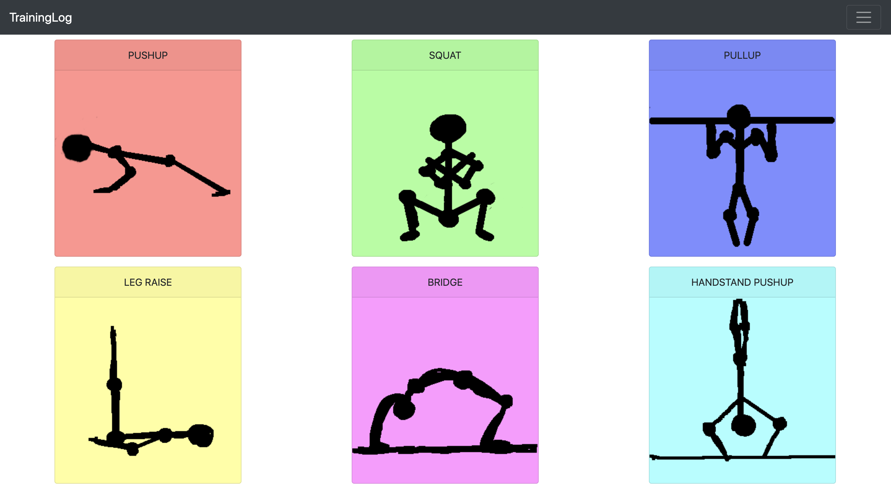
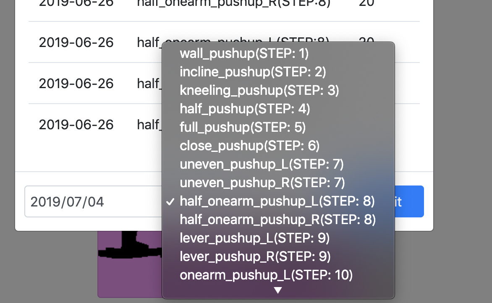
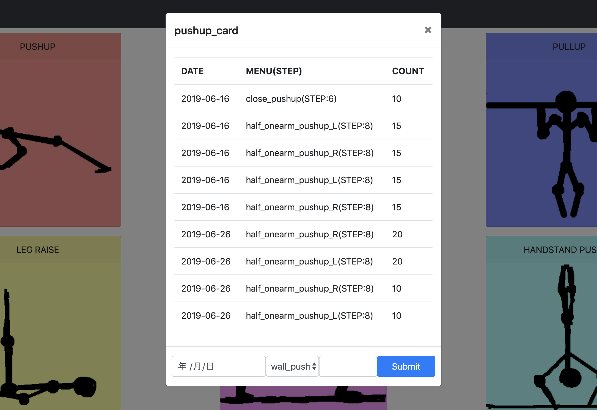

TrainingLog
===
筋トレの記録をつけるWebアプリケーションです．

[プリズナートレーニング](https://www.amazon.co.jp/%E3%83%97%E3%83%AA%E3%82%BA%E3%83%8A%E3%83%BC%E3%83%88%E3%83%AC%E3%83%BC%E3%83%8B%E3%83%B3%E3%82%B0-%E5%9C%A7%E5%80%92%E7%9A%84%E3%81%AA%E5%BC%B7%E3%81%95%E3%82%92%E6%89%8B%E3%81%AB%E5%85%A5%E3%82%8C%E3%82%8B%E7%A9%B6%E6%A5%B5%E3%81%AE%E8%87%AA%E9%87%8D%E7%AD%8B%E3%83%88%E3%83%AC-%E3%83%9D%E3%83%BC%E3%83%AB%E3%83%BB%E3%82%A6%E3%82%A7%E3%82%A4%E3%83%89/dp/4484171066/ref=sr_1_1?__mk_ja_JP=%E3%82%AB%E3%82%BF%E3%82%AB%E3%83%8A&keywords=%E3%83%97%E3%83%AA%E3%82%BA%E3%83%8A%E3%83%BC%E3%83%88%E3%83%AC%E3%83%BC%E3%83%8B%E3%83%B3%E3%82%B0&qid=1562224570&s=gateway&sr=8-1)
に合わせてメニューを作ってあります．

## Demo




## Requirement
* docker
* mysql

## Install
### DataBase
```shell
mysql -u training -p -h <host_name> training category < SQL/category_init.sql
mysql -u training -p -h <host_name> training menu < SQL/menu_init.sql
mysql -u training -p -h <host_name> training record < SQL/record_init.sql
```

### Web app
```shell
docker build -t training_log .
docker run -it -p 5000:5000 training_log
```
